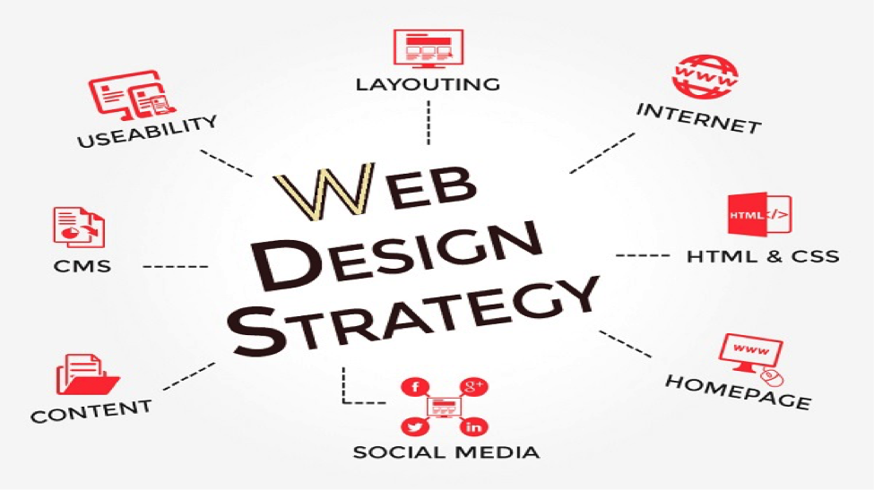

## Why use Semantic UI

My experience so far using Semantic UI are both frustrating and great. I have a little bit of experience using HTML during high school and there is a lot of typing and instead of saying, "ui menu", you make a menus using CSS. Even though Semantic UI can be frustrating because the result of your product is visually appealing than making websites using raw HTML/CSS. Moreover, Semantic UI is built to understand some word, such as, columns, rows, and icons making Semantic UI more easier to use than coding in HTML/CSS.  
