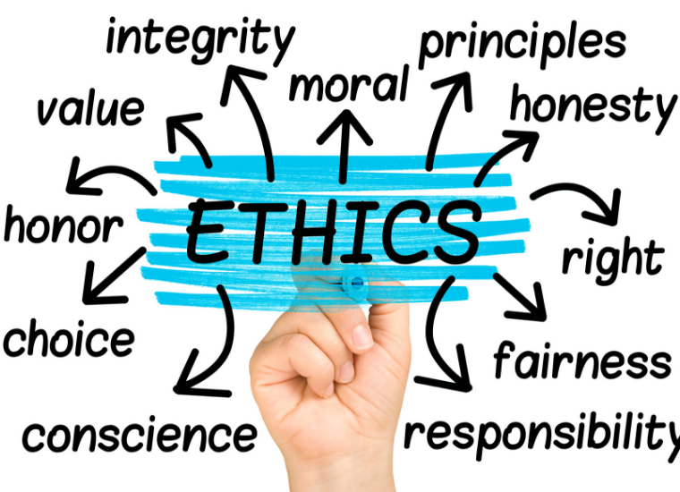

In general, ethics concerns that well-being of individuals as well as society. Ethics are used everwhere and differs for every individual or group, but in the context of software engineering it is:

All of these can be found at the [ACM website](https://www.acm.org/code-of-ethics) and [Computer Society webiste](https://www.computer.org/education/code-of-ethics).

* Being able to act in the best interest of the public and clients.
* Produce good quality work and maintain it
* Support your peers.
* Have better judgement on your work and others.

# Case Study: Privacy
Reading the ethics of ACM and Computer society, one of the similarities that both parties have is to think of the public and act in their best interest, while maintaining good judgement and upholding their privacy as well. Privacy is one of the sensitive topics in the world, no one wants their own private life to be breached but the creation of social media has already violated that fact. Moreover, Google went beyond by violating every person's privacy in the world by creating streetview. In 2007, Google launched streetview for Google maps. In streetview, a person can see every person's houses and streets, cars, and stores. Th act of being able to see people's addresses disurb the population. Moreover, people found out that criminals uses streetview to choose their targets and commit their acts, asa result making everyone's privacy vulnerable. 

Goole did try to calm the uproar by making sure that people can request the removal of their area in in streetview, however, another problem in their creation gained attention. People found that the vehicle that Google used to capture the streets collected various information about each individual, such as their medical records and emails. Google "claimed that this data had not been collected, later they said that only ‘fragments’ of such data had been retained." The statement from the article is proof that there were private information that was collected and they try to downplay their actions by stating that those datas are stored and protected. Google did ended up admitting that the vehicle collected those information but instead of owning to their faults and hold responsibility to what the company violated, Google blamed the "rouge engineer." In the end, Google owned up to their faults by breaching people's privacy and changed some of their policy in the company.

Overall, by creaing streetview Google already violated one of the ethic principles in ACM, which is privacy. Moreover, another principle that software engineers uphold is to think of how their creation affects the public interest, the company did not think of how the creation of their streetview would negatively affect people. It is true that streetview has some postive benefits, like being to search up places for your intinerary at a certain place. Though, at the same time people's houses or privacy are vulnerable to criminal acts because the layer of protection is easy to breakthrough just by googling the address. Furthermore, another ethic principle that was violated was how they should respect the ethics of principle and if any of the principle was violated they should take action and resolve the ethical issue. Google's mistake on handling their scandal was by dragging the incident and the company took three years to own up to their mistakes and acting in the best interest of the public. All of the the lawsuits that the company recieved would have been prevented if the company acted immediately and hold responsibility over their actions by being honest.

If the company should make another software that affects people's privacy, a warning to the public in a form of an announcement before the launch would be great because people will be aware and can take action before their privacy is shown to the public. Moreover, the complany should discuss the limits of privacy and how much can be implemented in their future projects, and discuss if their project do not violate the ethic principles of their company before creating the software.
