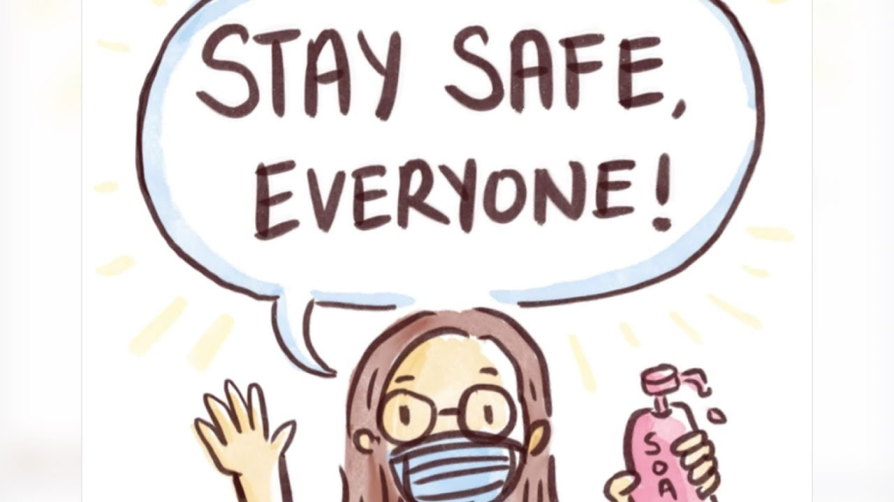

One of the reasons I enrolled in ICS 414 was because I enjoyed the team based group projects in ICS 314. I was expecting the class to be similar to ICS 314, but one thing that was unique in this class was that we had an actual client who looked at our apps. I like that the class kind of mimicked the experience in working in a software engineering industry, moreover, the class did not only let you build apps but it also challenged my soft skills and how I would work with different people with different skills. 

