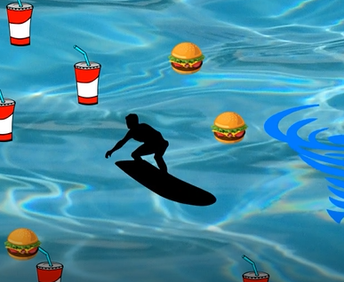

For this project we wrote the code on Java using Eclipse and implimented EZ graphics. This project is a one player game and it is controlled using the WASD keys. The goal of the game is to not let the surfer's thirst and hunger level reach to 0. There are items to keep the hunger and thirst level of the surfer above zero, which are consuming the food and drink images popping everywhere but make sure to avoid the hurricane because it decreases the level of the surfer's hunger and thirst level.

In this project I learned how to properly use Objects and Arrays, and to initiate classes one at a time. At first, I was having some trouble initiating all of the classes I made into the main program, moreover, I was initiatiating every single of my classes despite my professor telling our class to initiate our classes one at a time. 

Click on the link to see the demo [source](https://www.youtube.com/watch?v=ohFqVSmmilE).

