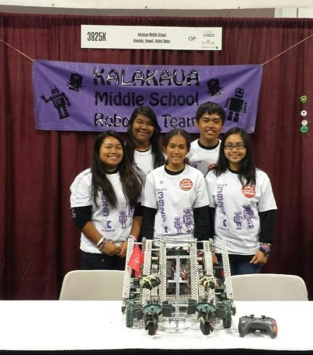

  Despite joining the vex robotics club in my middle school during my 8th grade, my team and I were able to qualify for the finals and join the World Championships at Anaheim, California. My team composed of five people and we had three categories to work on, which are robot design, building the robot, and programming the robot. 

  I was in charged of programming the robot and I had zero experience in coding, but I was interested om programming when I first joined the club. The good news is the the program that vex uses program their robot was beginner friendly and designed for amateurs, it was a click and drag type of coding. However, there was also typing involved such as the speed of the robot when turning or moving, moreover, you also need to think on how to use the commands to make your robot move the way you want it to do. I was all by myself programming the robot, but I was having fun learning new things and knowing that I made the robot move felt so good. 
  
  From this club I also learned how to work and think as team, as well as communication. Communication was a pretty big deal in my vex robotics club, we had to tell what we have to improve on the robot design or getting help on something we are stuck on. As a team we also decided that every single person would turn in a design and we each all would pick on one that we think was more stable and a great design to conquer the obstacles in the game, once we choose all of us would build the robot.
  
  The club taught me a lot about teamwork and communiation, the club wouldn't have been successful without the two. Everyone must involve the team in what they are doing or verbalize any problem that they have so we can all think together. The club was a fun experience and was the beginning of my interest in the STEM field.
  
To lean more about the the Vex robotics, click on the [source](https://www.vexrobotics.com/competition)
