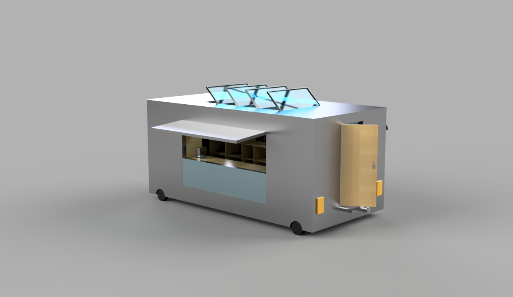
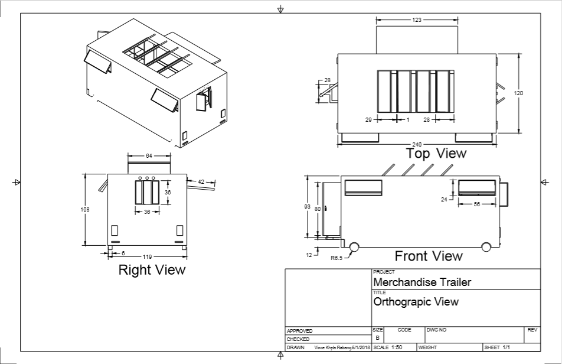

During my senior year in one of my engineering class, we were required to design a functional trailer for the World Surf League. The project was planned to last two semesters with the seniors designing the trailer for the group of juniors using their ideas and the juniors were the ones to complete the trailer during the next school year. There was about 10 groups working on a trailer design, the seniors drawing and making the trailer were chosen, and I was one of the lucky person and I was also paired up with another senior, Vincent, to make the design. 

In this project communication with our juniors was important because they are our "clients" and we were designing the trailer to how they imagined the look. Vincent and I used AutoCad to draw the plans, the picture on the top right, we divided the work because there was also details we have to inlude. We had to draw the outside structure and inside structure with all the interior. We also had deadlines, but before turning it in we must pass our work to our teacher first to check for errors, else we must correct that error.

Once the plans were completed, we had to tranform those designs into a 3D model. Vincent and I also decided to divide the work, but I did almost all of the intricate details for the interior of the trailer because I was used to the program, while Vincent was still trying to work with the software. I had no idea how the model was gonna turn out because that time was my first time creating a 3D model and using the software as well. However, gradually I was able to get used to the controls and making the shapes that I wanted. The project itself was eye straining if you did not try to take breaks, which I did,  

To learn more about the project read this [article](http://www.hawaiipublicschools.org/VisionForSuccess/SuccessStories/Schools/Pages/farringtonWSLpartnership.aspx).
