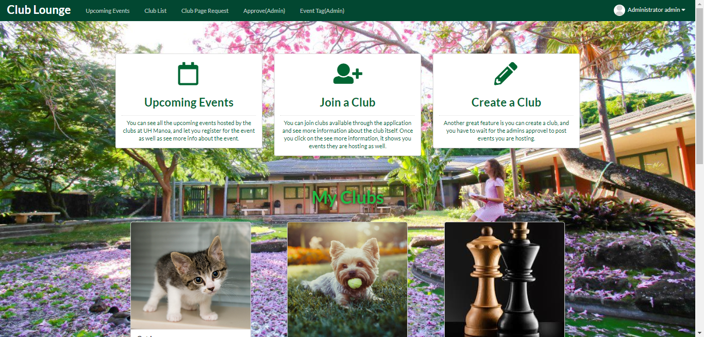

## What is Club Lounge?
Club Lounge is where students in the UH system can look up the clubs easily and either join or participate in any upcoming events and clubs. Students can also suggest clubs or events to the admin and the admin has the right to either decline or approve the request. Our goal was to give students an easier time to browse clubs because not many students attend the club recruitments in UH.

To learn more click [here](https://club-lounge.github.io/).

## The Team
The web application was made by [Jun Miao](https://junm1ao.github.io/), [Nomin Boldbayar](https://nominbold.github.io/), [Sang Jin Lee](https://sangjinlee808.github.io/) and me.

Prior to creating our website, we planned and discussed each issues and focuses for each milestone to breakdown the problems we need to tackle and avoid overwhelming ourselves. For the project I was responsible for:

* Upgrading the sign up page
* Creating the club page request page
* Link the "more info" button to the description and other information of the even at the upcoming event page.
* Adding the existing tags to the more info page for upcoming events.

## Overall Experience

The project was a fun experience because I never really had a proper group project where we communicate and have a specific issue assigned to each person. We held a meeting once or twice every week and used discord as base for our communication. My team wanted everyone to have equal contribution for our benefits and it was great working with them. I am truly greatful for my team because they answer every question that I need clarification on, specially with my issues, and if we need help on any of our issue they were willing to help solve the problem.

