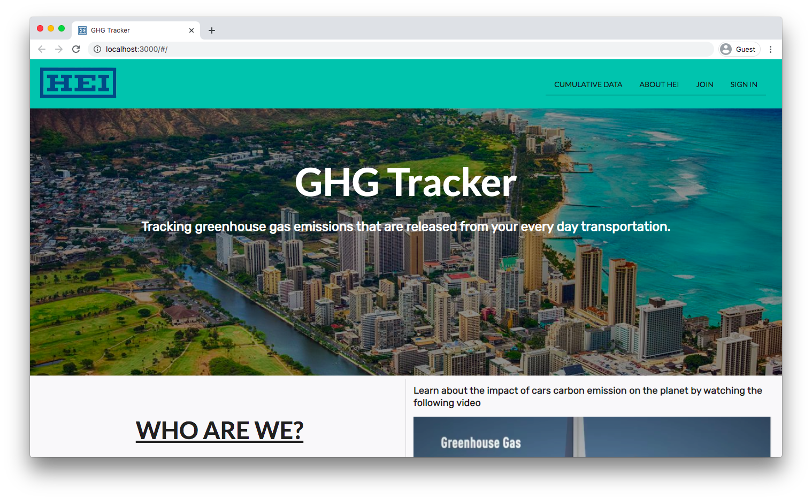

## What is GHG Tracker?
The GHG Tracker is a greenhouse gas emissions tracker that was created for the Hawaiian Electric Industries. The purpose of the application is to for users to track the amount of carbon that they have saved or used and introduces users to various alternative vehicles to lower more carbon emissions usage. There is also a community data on the amount of carbon emissions saved from every users in the app that can be viewed publicly. I worked on this project with Daphne Tapia, Anna Campainha, Jackie Wong, Sophia Cruz, Chak Hon Lam, Michael Gainey, Yiwen Chen and Timothy Huo. 

To learn more about the application and how to use it click the link: [GHG Tracker](https://hot-n-code.github.io/).

## Overall Experience

The project was a fun experience because I never really had a proper group project where we communicate and have a specific issue assigned to each person. We held a meeting once or twice every week and used discord as base for our communication. My team wanted everyone to have equal contribution for our benefits and it was great working with them. I am truly greatful for my team because they answer every question that I need clarification on, specially with my issues, and if we need help on any of our issue they were willing to help solve the problem.
